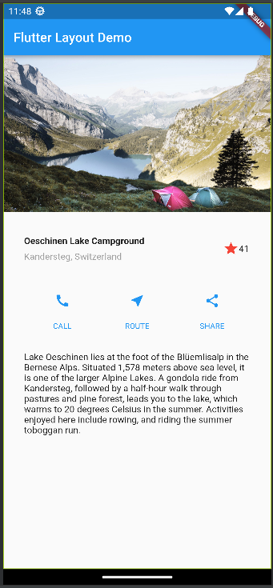
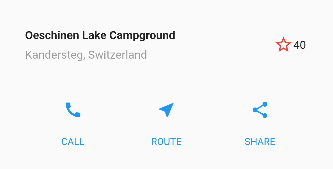
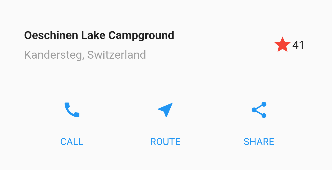
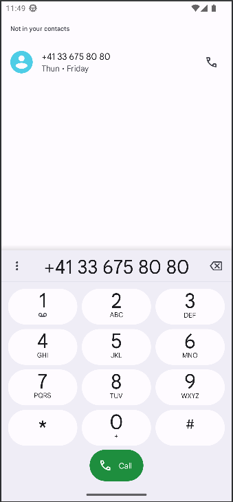
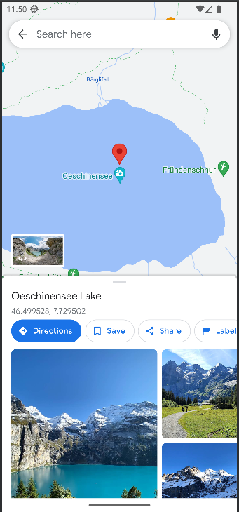
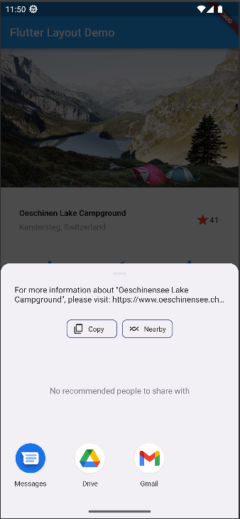

# SOFE4640U Assignment 2 - Flutter Practice

Name: Roniel Casaclang
Student ID: 100755336

## Objective

Practice Flutter application development, specifically widgets.

## Building Layouts

<table>
    <tr>
        <th colspan="2">
            Steps in building and designing a Flutter Application
        </th>
    </tr>
    <tr>
        <td>
              
        </td>
        <td>
            <li>
                Step 1: Diagram the layout
            </li>
            <li>
                Step 2: Implement the title row
            </li>
            <li>
                Step 3: Implement the button row
            </li>
            <li>
                Step 4: Implement the text section
            </li>
            <li>
                Step 5: Implement the image section
            </li>
            <li>
               Step 6: Final touch 
            </li>
        </td>
    </tr>
</table>

## Interactive Buttons

Interacting with the ***STAR*** will favourite the "Oeschinen Lake Campground"

|  Default | Favourite |
| :---------------: | :---------------: |
| || 
| Star is Unfilled (not favourited)  | Star is Filled and Count is increased |

Interacting with any of the buttons ***(CALL, ROUTE, SHARE)*** will show the corresponding actions:

| Call Button | Route Button | Share Button |
| :---------------: | :---------------: | :---------------: |
|  |  |    |

